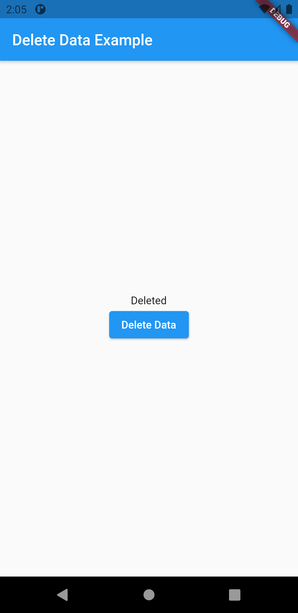

# delete_data_on_internet

This recipe covers how to delete data over the internet using the http package.

<table>
  <tr>
    <td>Click to Delete</td>
     <td>Deleted</td>
  </tr>
  <tr>
    <td></td>
    <td></td>
 
  </tr>
 </table>